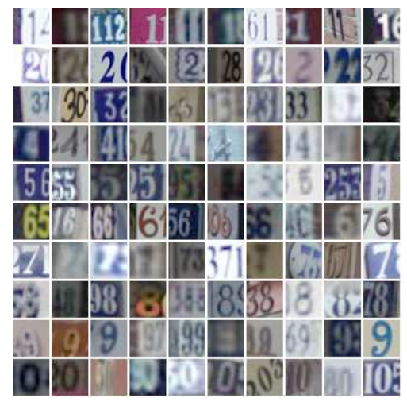

[![MIT License][license-shield]][license-url]
[![LinkedIn][linkedin-shield]][linkedin-url]

<!-- PROJECT LOGO -->
 

  
  <h6 align="center"; display: flex; justify-content: center> </h6>

 
 

<!-- TABLE OF CONTENTS -->

  
Table of Contents

  <ol>
    <li>
      <a href="#about-the-project">About The Project</a>
    </li>
    <li><a href="#contributing">Contributing</a></li>
    <li><a href="#license">License</a></li>
    <li><a href="#contact">Contact</a></li>
    <li><a href="#acknowledgments">Acknowledgments</a></li>
  </ol>

<!-- ABOUT THE PROJECT -->
## About The Project

:star:<b> Algorithms used in this project </b>

<ul>
  <li>
    <b><a href="https://arxiv.org/abs/1706.02275">MADDPG (Multi-Agent Deep Deterministic Policy Gradient)</a>:</b> MADDPG, or Multi-agent DDPG, extends                                                       DDPG into a multi-agent policy gradient algorithm where decentralized agents learn a centralized critic                                                     based on the observations and actions of all agents.
  </li
  <li>
     <b><a href="https://arxiv.org/abs/1803.11485">QMIX (Monotonic Value Function Factorisation for Deep Multi-Agent Reinforcement Learning)</a>:</b> QMIX                                                    is a multi agent deep reinforcement learning methods based on Q-learning and value-defactorazations;                                                        novel value-based method that can train decentralised policies in a centralised end-to-end fashion
  </li>
  <li>
    <b><a href="https://nn.cs.utexas.edu/downloads/papers/stanley.cec02.pdf">NEAT (NeuroEvolution of Augmenting Topology)</a>:</b> NEAT (NeuroEvolution of                                                                Augmenting Topologies) is an evolutionary algorithm that creates artificial neural networks
  </li>
  <li>
    <b><a href="https://link.springer.com/article/10.1007/s10479-005-5724-z">CEM (Cross Enthropy Method)</a>: </b> The cross-entropy method is a versatile              heuristic tool for solving difficult estimation and optimization problems, based on Kullback–Leibler (or cross-entropy) minimization.
  </li>
  <li>
    <b><a href="https://en.wikipedia.org/wiki/CMA-ES">CMA-ES (Covariance Matrix Adaption - Evolutionary Strategies): (PSO)</a>:</b> The  CMA-ES (Covariance                   Matrix Adaptation Evolution Strategy) is an evolutionary algorithm for difficult non-linear non-convex black-box optimisation problems in                   continuous domain
  </li>
  <li>
    <b>Genetic:</b> A genetic algorithm is a search heuristic that is inspired by Charles Darwin’s theory of natural evolution. This algorithm reflects the                     process of natural selection where the fittest individuals are selected for reproduction in order to produce offspring of the next                         generation. 
  </li>
   
</ul>

(<a href="#top">back to top</a>)

<!-- CONTRIBUTING -->
## Contributing

If you have a suggestion that would make this better, please fork the repo and create a pull request. You can also simply open an issue with the tag "enhancement".
Don't forget to give the project a star! Thanks again!

1. Fork the Project
2. Create your Feature Branch (`git checkout -b feature/AmazingFeature`)
3. Commit your Changes (`git commit -m 'Add some AmazingFeature'`)
4. Push to the Branch (`git push origin feature/AmazingFeature`)
5. Open a Pull Request

(<a href="#top">back to top</a>)

<!-- LICENSE -->
## License

Distributed under the MIT License. See `LICENSE.txt` for more information.

(<a href="#top">back to top</a>)

<!-- CONTACT -->
## Contact

aidin kazempour - [linkdin](https://www.linkedin.com/in/aidin-kazempour-b647811ba/) - aydinkazempour7@gmail.com

Project Link: [https://github.com/ay-ka/Algorithms](https://github.com/ay-ka/WordCloud)

(<a href="#top">back to top</a>)

<!-- ACKNOWLEDGMENTS -->
## Acknowledgments

Use this space to list resources you find helpful and would like to give credit to. I've included a few of my favorites to kick things off!

* [pytopia - a platform for learning python](https://www.pytopia.ai/)

(<a href="#top">back to top</a>)

[license-shield]: https://img.shields.io/github/license/othneildrew/Best-README-Template.svg?style=for-the-badge
[license-url]: https://github.com/othneildrew/Best-README-Template/blob/master/LICENSE.txt
[linkedin-shield]: https://img.shields.io/badge/-LinkedIn-black.svg?style=for-the-badge&logo=linkedin&colorB=555
[linkedin-url]: https://www.linkedin.com/in/aidin-kazempour-b647811ba/
[product-screenshot]: images/screenshot.png

  <li>
    <b>MADDPG applied on Robosuite: </b> This project is about Implementing <b>MADDPG</b> and applying that on <a                                                                        href="https://robosuite.ai/">Robosuite benchmark</a>
  </li>
