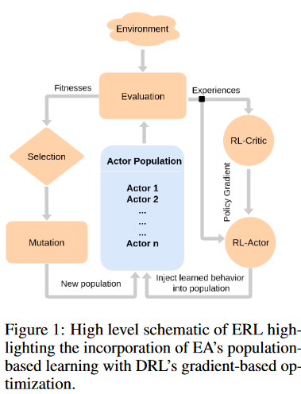
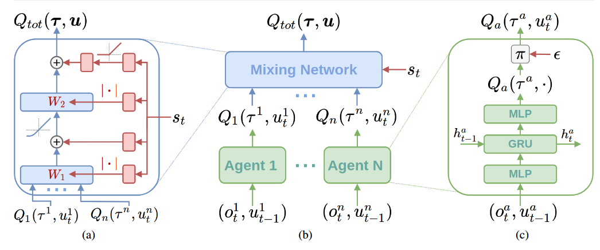

<div id="top"></div>


[![MIT License][license-shield]][license-url]
[![LinkedIn][linkedin-shield]][linkedin-url]


<!-- PROJECT LOGO -->
<br />
<div align="center">
  <a href="https://github.com/ay-ka/Qemix">
    
    
  </a>
  <h6 align="center"; display: flex; justify-content: center> this project is about combining QMIX with Evolutionary algorithms (Genetic) based on <br/>      method proposed in <a href="https://arxiv.org/pdf/1805.07917.pdf">Evolution-Guided Policy Gradient in Reinforcement Learning</a></h6>
</div>

<br />
<br />

<!-- TABLE OF CONTENTS -->
<details>
  <summary>Table of Contents</summary>
  <ol>
    <li>
      <a href="#about-the-project">About The Project</a>
    </li>
    <li>
      <a href="#getting-started">Getting Started</a>
      <ul>
        <li><a href="#Prerequisites-Installation">Prerequisites & Installation</a></li>
        <li><a href="#How-To-Run">How To Run</a></li>
      </ul>
    </li>
    <li><a href="#contributing">Contributing</a></li>
    <li><a href="#license">License</a></li>
    <li><a href="#contact">Contact</a></li>
    <li><a href="#acknowledgments">Acknowledgments</a></li>
  </ol>
</details>


<!-- ABOUT THE PROJECT -->
## About The Project


:star:<b> Algorithms used in this project </b>

<ul>
  <li>
    <b><a href="https://arxiv.org/abs/1706.02275">MADDPG (Multi-Agent Deep Deterministic Policy Gradient)</a>:</b> MADDPG, or Multi-agent DDPG, extends                                                       DDPG into a multi-agent policy gradient algorithm where decentralized agents learn a centralized critic                                                     based on the observations and actions of all agents.
  </li
  <li>
     <b><a href="https://arxiv.org/abs/1803.11485">QMIX (Monotonic Value Function Factorisation for Deep Multi-Agent Reinforcement Learning)</a>:</b> QMIX                                                    is a multi agent deep reinforcement learning methods based on Q-learning and value-defactorazations;                                                        novel value-based method that can train decentralised policies in a centralised end-to-end fashion
  </li>
  <li>
    <b><a href="https://nn.cs.utexas.edu/downloads/papers/stanley.cec02.pdf">NEAT (NeuroEvolution of Augmenting Topology)</a>:</b> NEAT (NeuroEvolution of                                                                Augmenting Topologies) is an evolutionary algorithm that creates artificial neural networks
  </li>
  <li>
    <b><a href="https://link.springer.com/article/10.1007/s10479-005-5724-z">CEM (Cross Enthropy Method)</a>: </b> The cross-entropy method is a versatile              heuristic tool for solving difficult estimation and optimization problems, based on Kullback–Leibler (or cross-entropy) minimization.
  </li>
  <li>
    <b><a href="https://en.wikipedia.org/wiki/CMA-ES">CMA-ES (Covariance Matrix Adaption - Evolutionary Strategies): (PSO)</a>:</b> The  CMA-ES (Covariance                   Matrix Adaptation Evolution Strategy) is an evolutionary algorithm for difficult non-linear non-convex black-box optimisation problems in                   continuous domain
  </li>
  <li>
    <b>Genetic:</b> A genetic algorithm is a search heuristic that is inspired by Charles Darwin’s theory of natural evolution. This algorithm reflects the                     process of natural selection where the fittest individuals are selected for reproduction in order to produce offspring of the next                         generation. 
  </li>
  <br/>
</ul>


:star:<b> Benchmarked used in this project </b>

<ul>
  <li>
    <b><a href="https://robosuite.ai/">Robosuite (Robotic Manipulator Benchmark)</a>:</b> robosuite is a simulation framework powered by the MuJoCo physics                                                     engine for robot learning. It also offers a suite of benchmark environments for reproducible research.
  </li
  <li>
    <b><a href="https://github.com/uoe-agents/robotic-warehouse">RWARE (Robotic Warehouse; A multi-agent reinforcement learning environment)</a>:</b> The                           multi-robot warehouse (RWARE) environment simulates a warehouse with robots moving and delivering requested goods. We based the                             simulator on real-world applications, in which robots pick-up shelves and deliver them to a workstation.
  </li>
  <li>
    <b><a href="https://github.com/openai/multiagent-particle-envs">MPE (Multi-Agent Particle Environment)</a>:</b> A simple multi-agent particle world                                                           with a continuous observation and discrete action space, along with some basic simulated physics.
  </li>
  <li>
    <b><a href="https://github.com/uoe-agents/pressureplate">PRESSUREPLATE</a>: </b> PressurePlate is a multi-agent environment that requires agents             to cooperate during the traversal of a gridworld. The grid is partitioned into several rooms, and each room contains a plate and a closed                   doorway.
  </li>
</ul>


:star:<b> Describe Implemented projects</b>

<ul>
  <li>
     <b>ERL_MADDPG:</b> This project is about Implementing <b>MADDPG</b> and combining it with <b>Genetic Algorithm</b> based on method proposed on <a        href="https://arxiv.org/abs/1805.07917">Evolution-Guided Policy Gradient In Reinforcement Learning</a>, apllied on <b>RWARE, MPE, PRESSUREPLATE</b>
  </li>
  <li>
     <b>ROBOSUITE_MADDPG:</b> This project is about Implementing <b>MADDPG</b> and combining it with <b>Genetic Algorithm</b> based on method proposed on <a        href="https://arxiv.org/abs/1805.07917">Evolution-Guided Policy Gradient In Reinforcement Learning</a>, apllied on <b>Robosuite</b>
  </li>
  <li>
    <b>NEAT_QMIX:</b> This project is about Implementing <b>QMIX</b> and combining with <b>NEAT</b> taken from <a                                                                href="https://neat-python.readthedocs.io">Repo</a> and evaluate on <b>RWARE</b> benchmark
  </li>
    <li>
    <b>CEM-MADDPG:</b> This project is about Implementing <b>MADDPG</b> and <b>CEM</b> Algorithms as well as combining these two algorithms;                         and evaluating on <b>RWARE, MPE, PRESSUREPLATE</b> benchmarks (this project need future improvements)
  </li>
  <li>
     <b>CMAES_MADDPG:</b> This project is about Implementing <b>MADDPG</b> and <b>CAM-ES</b> Algorithms as well as combining these two                                       algorithms and evaluating on <b>RWARE, MPE, PRESSUREPLATE</b> benchmarks (this project need future improvements)
  </li>
</ul>


<p align="right">(<a href="#top">back to top</a>)</p>


## Getting Started

this section explain instructions which should be followed to setting up the project. it is easier to run scripts from terminal by passing argument with the help of argparse library and this project also follow this pattern

### Prerequisites-Installation

<ul>
  <li>
    Robosuite Instalation: for installing Robosuite follow : <a href="https://robosuite.ai/docs/installation.html">Robosuite</a>
  </li>
  <li>
    RWARE Installation: for installing RWARE follow : <a href="https://github.com/semitable/robotic-warehouse">RWARE</a>
  </li>
   <li>
    MPE Installation: for installing MPE (Pettingzoo Library is used) follow : <a href="https://github.com/Farama-Foundation/PettingZoo">Pettingzoo</a>
  </li>
  <li>
    PressurePlate Installation: for installing PressurePlate follow : <a href="https://github.com/uoe-agents/pressureplate">PressurePlate</a>
  </li>
  <li>
    NEAT Installation: for installing NEAT follow : <a href="https://neat-python.readthedocs.io/en/latest/">NEAT</a>
  </li>
  <li>install all library specified whithin <b>requirement.txt</b> on  your virtual env</li>
</ul>

### How To Run


<b>Run: <CEM_MADDPG & CMAES_MADDPG & ERL_MADDPG> </b> 


<h6>RWARE Benchmark</h6>

```sh
git clone https://github.com/ay-ka/Reinforcement-Learning.git
cd Reinforcement-Learning
export PYTHONPATH=$PWD
python src/<algorithm-directory-name>/main.py RWARE --arguments
```

<h6>PressurePlate Benchmark</h6>

```sh
git clone https://github.com/ay-ka/Reinforcement-Learning.git
cd Reinforcement-Learning
export PYTHONPATH=$PWD
python src/<algorithm-directory-name>/main.py PressurePlate --arguments
```

<h6>MPE Benchmark</h6>

```sh
git clone https://github.com/ay-ka/Reinforcement-Learning.git
cd Reinforcement-Learning
export PYTHONPATH=$PWD
python src/<algorithm-directory-name>/main.py MPE --arguments
```

for example for ERL_MADDPG for RWARE Benchmark:

```sh
git clone https://github.com/ay-ka/Reinforcement-Learning.git
cd Reinforcement-Learning
export PYTHONPATH=$PWD
python src/ERL_MADDPG/main.py RWARE --popsize ? --otherarguments ?
```
  
for example for CEM_MADDPG for PressurePlate Benchmark:

```sh
git clone https://github.com/ay-ka/Reinforcement-Learning.git
cd Reinforcement-Learning
export PYTHONPATH=$PWD
python src/CEM_MADDPG/main.py PressurePlate --popsize ? --otherarguments ?
```


  
<b><ROBOSUITE_MADDPG (only robosuite)></b> 

<h6>ROBOSUITE Benchmark</h6>

```sh
git clone https://github.com/ay-ka/Reinforcement-Learning.git
cd Reinforcement-Learning
export PYTHONPATH=$PWD
python src/<algorithm-directory-name>/main.py RobotManipulator --arguments
```

for example for ROBOSUITE_MADDPG for ROBOSUITE Benchmark:

```sh
git clone https://github.com/ay-ka/Reinforcement-Learning.git
cd Reinforcement-Learning
export PYTHONPATH=$PWD
python src/ROBOSUITE_MADDPG/main.py RobotManipulator --popsize ? --otherarguments ?
```


<b><QMIX_NEAT (only RWARE)></b> 

<h6>RWARE Benchmark</h6>

```sh
git clone https://github.com/ay-ka/Reinforcement-Learning.git
cd Reinforcement-Learning
export PYTHONPATH=$PWD
python src/<algorithm-directory-name>/main.py RWARE --arguments
```

for example for QMIX_NEAT for RWARE Benchmark:

```sh
git clone https://github.com/ay-ka/Reinforcement-Learning.git
cd Reinforcement-Learning
export PYTHONPATH=$PWD
python src/QMIX_NEAT/main.py RWARE --popsize ? --otherarguments ?
```


<h3><b>Take arguments list: </b></h3> All algorithms take various argument which can be passed through terminal. to get list of all argument used in                                             algorithm use --help: <br/><br/>

<b>Benchmarks Available:</b>
<ol type="1">
  <li><b>CEM_MADDPG & CMAES_MADDPG & ERL_MADDPG</b> --> RWARE, MPE, PressurePlate</li>
  <li><b>ROBOSUITE_MADDPG</b> --> Robosuite (in codes use RobotManipulator) </li>
  <li><b>QMIX_NEAT</b> --> RWARE</li>
</ol>
  
<br/>
  
<b>Run:</b> 
  
<b><h3><CEM_MADDPG & CMAES_MADDPG & ERL_MADDPG & ROBOSUITE_MADDPG></h3></b>


```sh
git clone https://github.com/ay-ka/Reinforcement-Learning.git
cd Reinforcement-Learning
export PYTHONPATH=$PWD
python src/<algorithm-directory-name>/main.py <benchmark_name> --help
```


for example for ROBOSUITE_MADDPG for ROBOSUITE Benchmark:

```sh
git clone https://github.com/ay-ka/Reinforcement-Learning.git
cd Reinforcement-Learning
export PYTHONPATH=$PWD
python src/ERL_MADDPG/main.py RobotManipulator --help
```
  
for example for CEM_MADDPG for PressurePlate Benchmark:

```sh
git clone https://github.com/ay-ka/Reinforcement-Learning.git
cd Reinforcement-Learning
export PYTHONPATH=$PWD
python src/CEM_MADDPG/main.py PressurePlate --help
```


  
<b><h3><ROBOSUITE_MADDPG (only robosuite)></h3></b> 

```sh
git clone https://github.com/ay-ka/Reinforcement-Learning.git
cd Reinforcement-Learning
export PYTHONPATH=$PWD
python src/<algorithm-directory-name>/main.py RobotManipulator --help
```

for example for ROBOSUITE_MADDPG for ROBOSUITE Benchmark:

```sh
git clone https://github.com/ay-ka/Reinforcement-Learning.git
cd Reinforcement-Learning
export PYTHONPATH=$PWD
python src/ROBOSUITE_MADDPG/main.py RobotManipulator --help
```


<b><h3><QMIX_NEAT (only RWARE)></h3></b> 
  
<h4>for QMIX arguments</h4>

```sh
git clone https://github.com/ay-ka/Reinforcement-Learning.git
cd Reinforcement-Learning
export PYTHONPATH=$PWD
python src/<algorithm-directory-name>/main.py <benchmark_name> --help
```
  
for example for QMIX_NEAT for RWARE Benchmark:

```sh
git clone https://github.com/ay-ka/Reinforcement-Learning.git
cd Reinforcement-Learning
export PYTHONPATH=$PWD
python src/QMIX_NEAT/main.py RWARE --help
```

<h4>for NEAT argument</h4>

```sh
git clone https://github.com/ay-ka/Reinforcement-Learning.git
cd Reinforcement-Learning
export PYTHONPATH=$PWD
cd src/QMIX_NEAT/neat
open config.txt file 
```
(for more information about NEAT arguments refer to <a href="https://neat-python.readthedocs.io/en/latest/config_file.html">Repo</a>


<!-- CONTRIBUTING -->
## Contributing


If you have a suggestion that would make this better, please fork the repo and create a pull request. You can also simply open an issue with the tag "enhancement".
Don't forget to give the project a star! Thanks again!

1. Fork the Project
2. Create your Feature Branch (`git checkout -b feature/AmazingFeature`)
3. Commit your Changes (`git commit -m 'Add some AmazingFeature'`)
4. Push to the Branch (`git push origin feature/AmazingFeature`)
5. Open a Pull Request

<p align="right">(<a href="#top">back to top</a>)</p>


<!-- LICENSE -->
## License

Distributed under the MIT License. See `LICENSE.txt` for more information.

<p align="right">(<a href="#top">back to top</a>)</p>


<!-- CONTACT -->
## Contact

aidin kazempour - [linkdin](https://www.linkedin.com/in/aidin-kazempour-b647811ba/) - aydinkazempour7@gmail.com

Project Link: [https://github.com/ay-ka/Algorithms](https://github.com/ay-ka/WordCloud)

<p align="right">(<a href="#top">back to top</a>)</p>


<!-- ACKNOWLEDGMENTS -->
## Acknowledgments

Use this space to list resources you find helpful and would like to give credit to. I've included a few of my favorites to kick things off!

* [pytopia - a platform for learning python](https://www.pytopia.ai/)


<p align="right">(<a href="#top">back to top</a>)</p>


[license-shield]: https://img.shields.io/github/license/othneildrew/Best-README-Template.svg?style=for-the-badge
[license-url]: https://github.com/othneildrew/Best-README-Template/blob/master/LICENSE.txt
[linkedin-shield]: https://img.shields.io/badge/-LinkedIn-black.svg?style=for-the-badge&logo=linkedin&colorB=555
[linkedin-url]: https://www.linkedin.com/in/aidin-kazempour-b647811ba/
[product-screenshot]: images/screenshot.png


  <li>
    <b>MADDPG applied on Robosuite: </b> This project is about Implementing <b>MADDPG</b> and applying that on <a                                                                        href="https://robosuite.ai/">Robosuite benchmark</a>
  </li>
