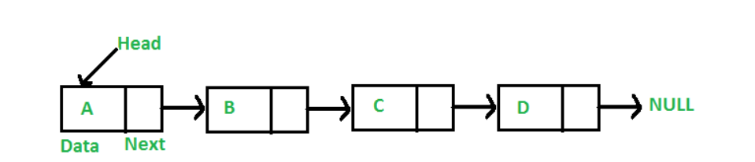
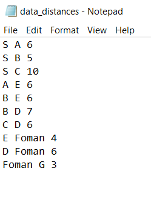
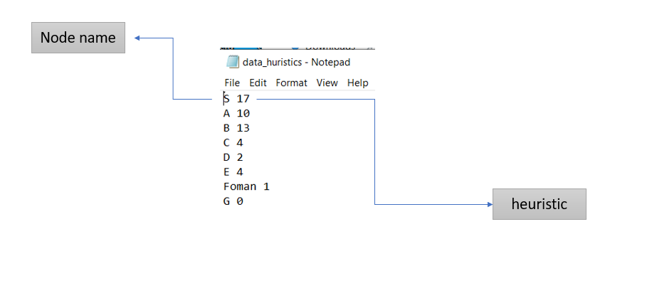
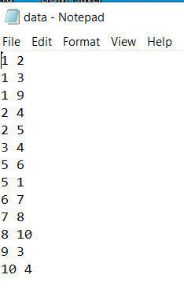
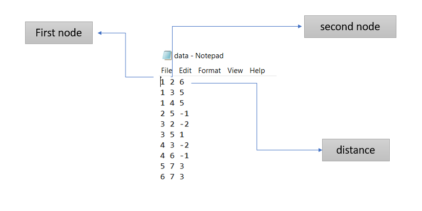
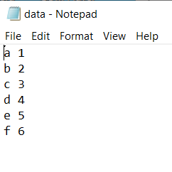
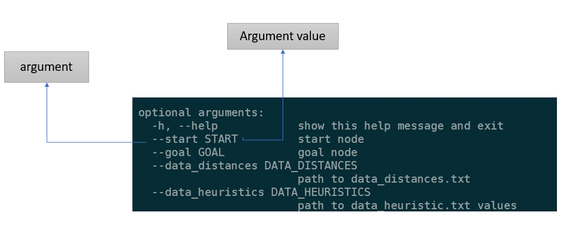
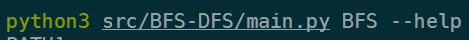
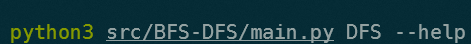

<div id="top"></div>


[![MIT License][license-shield]][license-url]
[![LinkedIn][linkedin-shield]][linkedin-url]


<!-- PROJECT LOGO -->
<br />
<div align="center">
  <a href="https://github.com/ay-ka/Algorithms">
    
  </a>
  <h5 align="center">implementing of various algorithm included informed graph  search & uninformed graph search & search methods & sort methods</h5>
</div>

<br />
<br />

<!-- TABLE OF CONTENTS -->
<details>
  <summary>Table of Contents</summary>
  <ol>
    <li>
      <a href="#about-the-project">About The Project</a>
    </li>
    <li>
      <a href="#getting-started">Getting Started</a>
      <ul>
        <li><a href="#Prerequisites-Installation">Prerequisites & Installation</a></li>
        <li><a href="#How-To-Run">How To Run</a></li>
      </ul>
    </li>
    <li><a href="#contributing">Contributing</a></li>
    <li><a href="#license">License</a></li>
    <li><a href="#contact">Contact</a></li>
    <li><a href="#acknowledgments">Acknowledgments</a></li>
  </ol>
</details>


<!-- ABOUT THE PROJECT -->
## About The Project

<ul>
  <li>
    <b>Graph Search</b>
    <ul>
      <li>
        <b>BFS</b>:  Breadth-First Traversal (or Search) for a graph is similar to Breadth-First Traversal of a tree (See method 2 of this post). The only                      catch here is, that, unlike trees, graphs may contain cycles, so we may come to the same node again. To avoid processing a node more                        than once, we use a boolean visited array. data structure used for this algorithm is <b>Queue</b>
      </li>
      <li>
        <b>DFS</b>: Depth First Traversal (or Search) for a graph is similar to Depth First Traversal of a tree. The only catch here is, unlike trees,                         graphs may contain cycles (a node may be visited twice). To avoid processing a node more than once, use a boolean visited array. data                       structure used for this algorithm is <b>Stack</b>
      </li>
      <li>
        <b>A*:</b> A* Search algorithm is one of the best and popular technique used in path-finding and graph traversals. Informally speaking, A* Search                      algorithms, unlike other traversal techniques, it has “brains”. What it means is that it is really a smart algorithm which separates it                    from the other conventional algorithms
      </li>
      <li>
        <b>Uniform Cost Search:</b> Uniform-Cost Search is a variant of Dijikstra’s algorithm. This variant of Dijkstra is useful for infinite graphs and                                       those graph which are too large to represent in the memory. data structure used for this algorithm is <b>Priority                                           Queue</b>
      </li>
      <li>
        <b>Bellman Ford:</b> Given a graph and a source vertex src in graph, find shortest paths from src to all vertices in the given graph. The graph may                              contain negative weight edges. 
      </li>
      <li>
        <b>Dijekstra:</b> Given a graph and a source vertex in the graph, find the shortest paths from the source to all vertices in the given graph.
      </li>
    </ul>
  </li>
  <li>
    <b>Search</b>
    <ul>
      <li>
        <b>Binary Search:</b> Binary Search is a searching algorithm used in a sorted array by repeatedly dividing the search interval in half. The idea of                               binary search is to use the information that the array is sorted and reduce the time complexity to O(Log n). 
      </li>
      <li>
        <b>Fibonachi Search:</b> Fibonacci Search is a comparison-based technique that uses Fibonacci numbers to search an element in a sorted array.
      </li>
    </ul>
  </li>
   <li>
     <b>Sort</b>
     <ul>
        <li>
          <b>Merge Sort:</b> The Merge Sort algorithm is a sorting algorithm that is considered as an example of the divide and conquer strategy.
       </li>
        <li>
          <b>Quick Sort:</b> Like Merge Sort, QuickSort is a Divide and Conquer algorithm. It picks an element as pivot and partitions the given array                                  around the picked pivo
       </li>
        <li>
          <b>Heap Sort:</b> Heap sort is a comparison-based sorting technique based on Binary Heap data structure. It is similar to selection sort where we                             first find the minimum element and place the minimum element at the beginning. We repeat the same process for the remaining                                 elements
       </li>
      </ul>
   </li>
   <li>
     <b>Linked List</b>
     <ul>
        <li>
          <b>Linked List:</b> A linked list is a linear data structure, in which the elements are not stored at contiguous memory locations. The elements                                 in a linked list are linked using pointers as shown in the below image:
        </li>
          
     </ul>
   </li>
</ul>


<p align="right">(<a href="#top">back to top</a>)</p>


## Getting Started

this section explain instructions which should be followed to setting up the project. it is easier to run scripts from terminal by passing argument with the help of argparse library and this project also follow this pattern

### Prerequisites-Installation

<ul>
  <li>
    there are text files named <b>data.txt</b> inside all algoritrhms directory. these <b>data.txt</b> are initially used as sample data. it can be             replaced by any other <b>data.txt</b> (inside <b>A*</b> these files are <b>data_huristics.txt</b> and <b>data_distances.txt</b>) file if it adopt           following patterns:
    <ol type="1">
      <li>
        <b>A*</b>
        <ol type="1">
          <li>
            <b>data_distances.txt:</b> inside this file pattern is -->  <br/>
            first_column = first_node_name; second_column = second_node_name (connected to first node); third_column = distances
            </b>
          </li>
          <li>
            <b>data_huristics.txt:</b> inside this file pattern is -->  first_column = node_name; second_column = city's huristic
          </li>
        </ol>
        
        
      </li>
      <li>
        <b>BFS-DFS</b>
        <ol type="1">
          <li>
              <b>data.txt:</b> inside this file pattern is -->  <br/>first_column = first_node_name; second_column = second_node_name (connected to first                                  node)
          </li>
        </ol>
        
      </li>
      <li>
        <b>Bellman-Ford</b>
        <ol type="1">
          <li>
              <b>data.txt:</b> inside this file pattern is -->  <br/>first_column = first_node_name; second_column = second_node_name (connected to first                                  node); third_column = distances
          </li>
        </ol>
        
      </li>
        <li>
        <b>Dijekstra</b>
        <ol type="1">
          <li>
              <b>data.txt:</b> inside this file pattern is -->  <br/>first_column = first_node_name; second_column = second_node_name (connected to first                                  node); third_column = distances
          </li>
        </ol>
        
      </li>
      <li>
        <b>LinkedList</b>
        <ol type="1">
          <li>
              <b>data.txt:</b> inside this file pattern is -->  <br/>first_column = node_name; second_column = node_value 
          </li>
        </ol>
        
      </li>
      <li>
        <b>UCS</b>
        <ol type="1">
          <li>
              <b>data.txt:</b> inside this file pattern is -->  <br/>first_column = first_node_name; second_column = second_node_name (connected to first                                  node); third_column = distances
          </li>
        </ol>
        
      </li>
    </ol>
  </li>
    
  <li>install all library specified whithin requirement.txt on  your virtual env</li>
</ul>

### How To Run


<b>Run:</b> there are two ways for running codes:

1- for AStar, UCS, LinkedList, Bellman-Ford, Dijsktra: <br/>
```sh
git clone https://github.com/ay-ka/Algorithms.git
cd Algorithms
export PYTHONPATH=$PWD
python src/<algorithm-directory-name>/main.py --arguments
```

*AStar
```sh
git clone https://github.com/ay-ka/Algorithms.git
cd Algorithms
export PYTHONPATH=$PWD
python src/Astar/main.py --start ? --goal ?
```
*Bellman-Ford
```sh
git clone https://github.com/ay-ka/Algorithms.git
cd Algorithms
export PYTHONPATH=$PWD
python src/Astar/main.py --start ?
```

2- for BFS-DFS, SEARCH, SORT
```sh
git clone https://github.com/ay-ka/Algorithms.git
cd Algorithms
export PYTHONPATH=$PWD
python src/<algorithm-directory-name>/main.py  ALGORITHMNAME(uppercase) --arguments
```

*** ALGORITHMNAME
<ol type="1">
  <li>for Search: BINARY, FIBO</li>
  <li>for Sort: MERGE, QUICK, HEAP</li>
  <li>BFS-DFS: BFS, DFS</li>
</ol>




<ul>
  <li>
    <b>Take arguments list</b> All algorithms take various argument which can be passed through terminal. to get list of all argument used in algorithm use --help:
  </li>
</ul>

<b>1- for AStar, UCS, LinkedList, Bellman-Ford, Dijsktra:</b>
<br/>
```sh
git clone https://github.com/ay-ka/Algorithms.git
cd Algorithms
export PYTHONPATH=$PWD
python src/<algorithm-directory-name>/main.py --help
```

for example for A*:

```sh
git clone https://github.com/ay-ka/Algorithms.git
cd Algorithms
export PYTHONPATH=$PWD
python src/Astar/main.py --help
```


2- <b>for BFS-DFS, SEARCH, SORT</b>

```sh
git clone https://github.com/ay-ka/Algorithms.git
cd Algorithms
export PYTHONPATH=$PWD
python src/<algorithm-directory-name>/main.py ALGORITHMNAME(uppercase) --help
```


for example for BFS & DFS:





<p align="right">(<a href="#top">back to top</a>)</p>


<!-- CONTRIBUTING -->
## Contributing


If you have a suggestion that would make this better, please fork the repo and create a pull request. You can also simply open an issue with the tag "enhancement".
Don't forget to give the project a star! Thanks again!

1. Fork the Project
2. Create your Feature Branch (`git checkout -b feature/AmazingFeature`)
3. Commit your Changes (`git commit -m 'Add some AmazingFeature'`)
4. Push to the Branch (`git push origin feature/AmazingFeature`)
5. Open a Pull Request

<p align="right">(<a href="#top">back to top</a>)</p>


<!-- LICENSE -->
## License

Distributed under the MIT License. See `LICENSE.txt` for more information.

<p align="right">(<a href="#top">back to top</a>)</p>


<!-- CONTACT -->
## Contact

aidin kazempour - [linkdin](https://www.linkedin.com/in/aidin-kazempour-b647811ba/) - aydinkazempour7@gmail.com

Project Link: [https://github.com/ay-ka/Algorithms](https://github.com/ay-ka/WordCloud)

<p align="right">(<a href="#top">back to top</a>)</p>


<!-- ACKNOWLEDGMENTS -->
## Acknowledgments

Use this space to list resources you find helpful and would like to give credit to. I've included a few of my favorites to kick things off!

* [pytopia - a platform for learning python](https://www.pytopia.ai/)


<p align="right">(<a href="#top">back to top</a>)</p>


[license-shield]: https://img.shields.io/github/license/othneildrew/Best-README-Template.svg?style=for-the-badge
[license-url]: https://github.com/othneildrew/Best-README-Template/blob/master/LICENSE.txt
[linkedin-shield]: https://img.shields.io/badge/-LinkedIn-black.svg?style=for-the-badge&logo=linkedin&colorB=555
[linkedin-url]: https://www.linkedin.com/in/aidin-kazempour-b647811ba/
[product-screenshot]: images/screenshot.png
