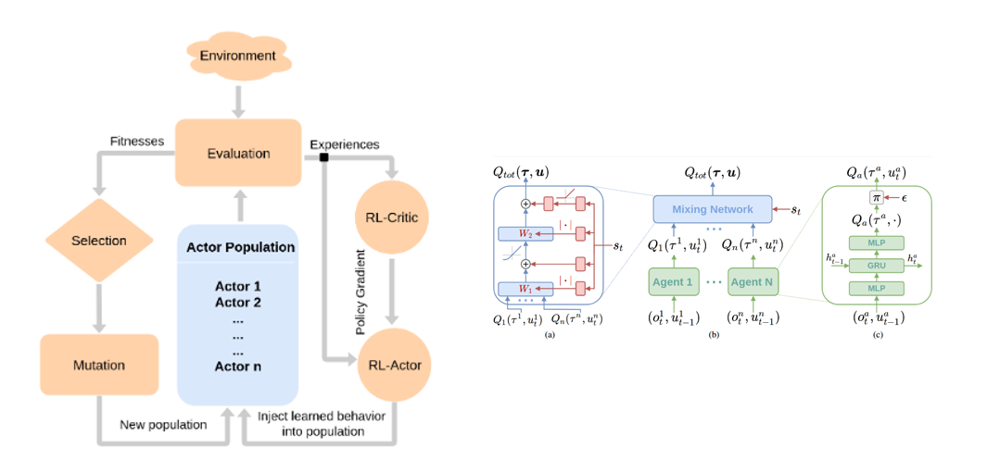

<div id="top"></div>


[![MIT License][license-shield]][license-url]
[![LinkedIn][linkedin-shield]][linkedin-url]


<!-- PROJECT LOGO -->
<br />
<div align="center">
  <a href="https://github.com/ay-ka/Qemix">
    
  </a>
  <h6 align="center"; display: flex; justify-content: center>The Project is about combining QMIX with Evolutionary algorithms (Genetic) based on <br/>      method proposed in <a href="https://arxiv.org/pdf/1805.07917.pdf">Evolution-Guided Policy Gradient in Reinforcement Learning</a></h6>
</div>

<br />
<br />

<!-- TABLE OF CONTENTS -->
<details>
  <summary>Table of Contents</summary>
  <ol>
    <li>
      <a href="#about-the-project">About The Project</a>
    </li>
    <li>
      <a href="#getting-started">Getting Started</a>
      <ul>
        <li><a href="#Prerequisites-Installation">Prerequisites & Installation</a></li>
        <li><a href="#How-To-Run">How To Run</a></li>
      </ul>
    </li>
    <li><a href="#contributing">Contributing</a></li>
    <li><a href="#license">License</a></li>
    <li><a href="#contact">Contact</a></li>
    <li><a href="#acknowledgments">Acknowledgments</a></li>
  </ol>
</details>


<!-- ABOUT THE PROJECT -->
## About The Project


:star:<b> Algorithms used in this project </b>

<ul>
  <li>
     <b><a href="https://arxiv.org/abs/1803.11485">QMIX (Monotonic Value Function Factorisation for Deep Multi-Agent Reinforcement Learning)</a>:</b> QMIX                                                    is a multi agent deep reinforcement learning methods based on Q-learning and value-defactorazations;                                                        novel value-based method that can train decentralised policies in a centralised end-to-end fashion
  </li>
  <li>
    <b><a href="https://arxiv.org/pdf/1805.07917.pdf">Evolutionary-Guided Policy Gradient in Reinforcement Learning: </a></b> hybrid algorithm that                                             leverages the population of an EA to provide diversified data to train an RL agent, and reinserts the RL agent into the                                     EA population periodically to inject gradient information into the EA. ERL inherits EA’s ability of temporal credit                                         assignment with a fitness metric, effective exploration with a diverse set of policies, and stability of a population-                                     based approach and complements it with off-policy DRL’s ability to leverage gradients for
                                    higher sample efficiency and faster learning
  </li>
  <li>
    <b>Genetic:</b> A genetic algorithm is a search heuristic that is inspired by Charles Darwin’s theory of natural evolution. This algorithm reflects the                     process of natural selection where the fittest individuals are selected for reproduction in order to produce offspring of the next                         generation. 
  </li>
  <br/>
</ul>


:star:<b> Benchmarked used in this project </b>

<ul>
  <li>
    <b><a href="https://github.com/uoe-agents/robotic-warehouse">RWARE (Robotic Warehouse; A multi-agent reinforcement learning environment)</a>:</b> The                           multi-robot warehouse (RWARE) environment simulates a warehouse with robots moving and delivering requested goods. We based the                             simulator on real-world applications, in which robots pick-up shelves and deliver them to a workstation.
  </li>
  <li>
    <b><a href="https://github.com/openai/multiagent-particle-envs">MPE (Multi-Agent Particle Environment)</a>:</b> A simple multi-agent particle world                                                           with a continuous observation and discrete action space, along with some basic simulated physics.
  </li>
  <li>
    <b><a href="https://github.com/uoe-agents/pressureplate">PRESSUREPLATE</a>: </b> PressurePlate is a multi-agent environment that requires agents             to cooperate during the traversal of a gridworld. The grid is partitioned into several rooms, and each room contains a plate and a closed                   doorway.
  </li>
</ul>


<p align="right">(<a href="#top">back to top</a>)</p>


## Getting Started

this section explain instructions which should be followed to setting up the project. it is easier to run scripts from terminal by passing argument with the help of argparse library and this project also follow this pattern

### Prerequisites-Installation

<ul>
  <li>
    RWARE Installation: for installing RWARE follow : <a href="https://github.com/semitable/robotic-warehouse">RWARE</a>
  </li>
   <li>
    MPE Installation: for installing MPE (Pettingzoo Library is used) follow : <a href="https://github.com/Farama-Foundation/PettingZoo">Pettingzoo</a>
  </li>
  <li>
    PressurePlate Installation: for installing PressurePlate follow : <a href="https://github.com/uoe-agents/pressureplate">PressurePlate</a>
  </li>
  <li>install all library specified whithin <b>requirement.txt</b> on  your virtual env</li>
</ul>

### How To Run


<b>Run: </b> 


<h6>RWARE Benchmark</h6>

```sh
git clone https://github.com/ay-ka/Qemix.git
cd Qemix
export PYTHONPATH=$PWD
python src/main.py RWARE --arguments
```

<h6>PressurePlate Benchmark</h6>

```sh
git clone https://github.com/ay-ka/Qemix.git
cd Qemix
export PYTHONPATH=$PWD
python src/main.py PressurePlate --arguments
```

<h6>MPE Benchmark</h6>

```sh
git clone https://github.com/ay-ka/Qemix.git
cd Qemix
export PYTHONPATH=$PWD
python src/main.py MPE --arguments
```

for example:

```sh
git clone https://github.com/ay-ka/Qemix.git
cd Qemix
export PYTHONPATH=$PWD
python src/main.py RWARE --popsize ? --otherarguments ?
```
  


<h3><b>Take arguments list: </b></h3> All algorithms take various argument which can be passed through terminal. to get list of all argument used in                                             algorithm use --help: <br/><br/>

<b>Benchmarks Available:</b>
<ol type="1">
  <li><b>RWARE</b></li>
  <li><b>MPE</b></li>
  <li><b>PressurePlate</b></li>
</ol>
  
<br/>
  

```sh
git clone https://github.com/ay-ka/Qemix.git
cd Qemix
export PYTHONPATH=$PWD
python src/main.py <benchmark_name> --help
```


for example for RWARE Benchmark:

```sh
git clone https://github.com/ay-ka/Qemix.git
cd Qemix
export PYTHONPATH=$PWD
python src/main.py RWARE --help
```
  


(for more information about NEAT arguments refer to <a href="https://neat-python.readthedocs.io/en/latest/config_file.html">Repo</a>


<!-- CONTRIBUTING -->
## Contributing


If you have a suggestion that would make this better, please fork the repo and create a pull request. You can also simply open an issue with the tag "enhancement".
Don't forget to give the project a star! Thanks again!

1. Fork the Project
2. Create your Feature Branch (`git checkout -b feature/AmazingFeature`)
3. Commit your Changes (`git commit -m 'Add some AmazingFeature'`)
4. Push to the Branch (`git push origin feature/AmazingFeature`)
5. Open a Pull Request

<p align="right">(<a href="#top">back to top</a>)</p>


<!-- LICENSE -->
## License

Distributed under the MIT License. See `LICENSE.txt` for more information.

<p align="right">(<a href="#top">back to top</a>)</p>


<!-- CONTACT -->
## Contact

aidin kazempour - [linkdin](https://www.linkedin.com/in/aidin-kazempour-b647811ba/) - aydinkazempour7@gmail.com

Project Link: [https://github.com/ay-ka/Algorithms](https://github.com/ay-ka/WordCloud)

<p align="right">(<a href="#top">back to top</a>)</p>


<!-- ACKNOWLEDGMENTS -->
## Acknowledgments

Use this space to list resources you find helpful and would like to give credit to. I've included a few of my favorites to kick things off!

* [pytopia - a platform for learning python](https://www.pytopia.ai/)


<p align="right">(<a href="#top">back to top</a>)</p>


[license-shield]: https://img.shields.io/github/license/othneildrew/Best-README-Template.svg?style=for-the-badge
[license-url]: https://github.com/othneildrew/Best-README-Template/blob/master/LICENSE.txt
[linkedin-shield]: https://img.shields.io/badge/-LinkedIn-black.svg?style=for-the-badge&logo=linkedin&colorB=555
[linkedin-url]: https://www.linkedin.com/in/aidin-kazempour-b647811ba/
[product-screenshot]: images/screenshot.png


  <li>
    <b>MADDPG applied on Robosuite: </b> This project is about Implementing <b>MADDPG</b> and applying that on <a                                                                        href="https://robosuite.ai/">Robosuite benchmark</a>
  </li>
