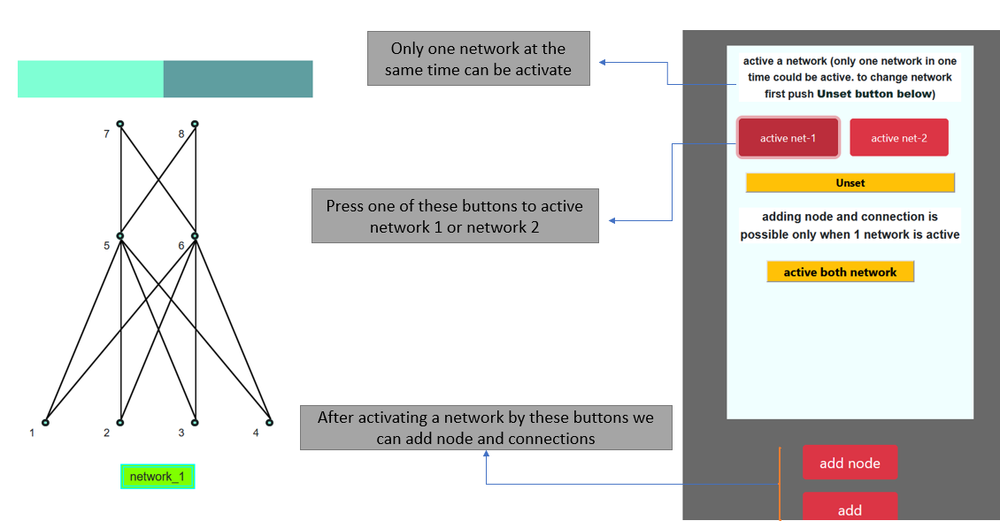
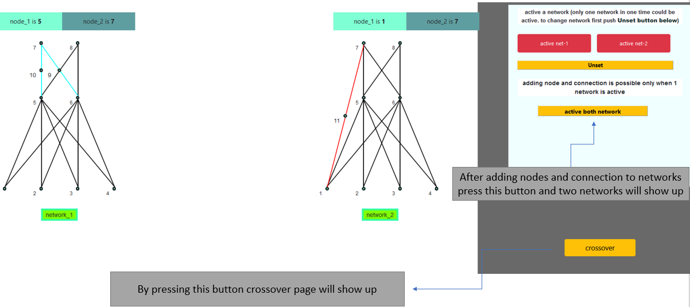

[![MIT License][license-shield]][license-url]
[![LinkedIn][linkedin-shield]][linkedin-url]

<!-- PROJECT LOGO -->

 
 

<!-- TABLE OF CONTENTS -->

  
Table of Contents

  <ol>
    <li>
      <a href="#about-the-project">About The Project</a>
    </li>
      <li>
      <a href="#how-to-use">How To Use</a>
    </li>
    <li><a href="#contributing">Contributing</a></li>
    <li><a href="#license">License</a></li>
    <li><a href="#contact">Contact</a></li>
    <li><a href="#acknowledgments">Acknowledgments</a></li>
  </ol>

<!-- ABOUT THE PROJECT -->
## About The Project

 <b>NEAT:</b> NEAT (NeuroEvolution of Augmenting Topologies) is an evolutionary algorithm that creates and evolves artificial neural networks by adding                   nodes and connections to network throughout generations (mutation) and crossovering between networks (crossover)
 
 <b>This project (NEAT_Visuializer):</b> at this project it has been tried to visuialize <b>adding nodes</b> and <b>adding connections</b> part in NEAT                   paper to get better understanding of mutation done in paper alongside <b>crossover</b> operator on networks 
 
 

(<a href="#top">back to top</a>)

### How To Use

<ul>
  
  <b><h2>Active a network and add node and connections</h2>
  
  
  <b><h2>Unset network</h2></b>
  
  
  <b><h2>crossover by activating both betwork</h2></b>
   
  <b><h2>start crossover</h2></b>
  
  
</ul>

<h1>⭐ link to Website: <a href="https://ay-ka.github.io/NEAT_Visuializer/">Web</a></h1>

  

 
  
<!-- CONTRIBUTING -->
## Contributing

If you have a suggestion that would make this better, please fork the repo and create a pull request. You can also simply open an issue with the tag "enhancement".
Don't forget to give the project a star! Thanks again!

1. Fork the Project
2. Create your Feature Branch (`git checkout -b feature/AmazingFeature`)
3. Commit your Changes (`git commit -m 'Add some AmazingFeature'`)
4. Push to the Branch (`git push origin feature/AmazingFeature`)
5. Open a Pull Request

(<a href="#top">back to top</a>)

<!-- LICENSE -->
## License

Distributed under the MIT License. See `LICENSE.txt` for more information.

(<a href="#top">back to top</a>)

<!-- CONTACT -->
## Contact

aidin kazempour - [linkdin](https://www.linkedin.com/in/aidin-kazempour-b647811ba/) - aydinkazempour7@gmail.com

Project Link: [https://github.com/ay-ka/Algorithms](https://github.com/ay-ka/WordCloud)

(<a href="#top">back to top</a>)

<!-- ACKNOWLEDGMENTS -->
## Acknowledgments

Use this space to list resources you find helpful and would like to give credit to. I've included a few of my favorites to kick things off!

* [pytopia - a platform for learning python](https://www.pytopia.ai/)

(<a href="#top">back to top</a>)

[license-shield]: https://img.shields.io/github/license/othneildrew/Best-README-Template.svg?style=for-the-badge
[license-url]: https://github.com/othneildrew/Best-README-Template/blob/master/LICENSE.txt
[linkedin-shield]: https://img.shields.io/badge/-LinkedIn-black.svg?style=for-the-badge&logo=linkedin&colorB=555
[linkedin-url]: https://www.linkedin.com/in/aidin-kazempour-b647811ba/
[product-screenshot]: images/screenshot.png

  <li>
    <b>MADDPG applied on Robosuite: </b> This project is about Implementing <b>MADDPG</b> and applying that on <a                                                                        href="https://robosuite.ai/">Robosuite benchmark</a>
  </li>
